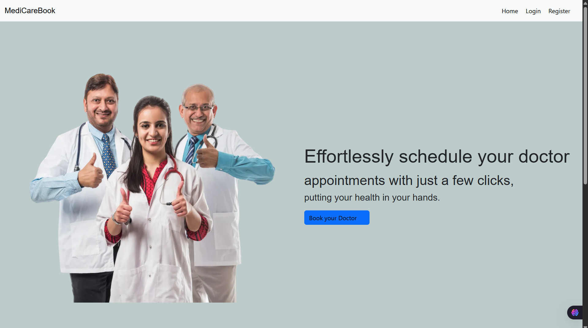
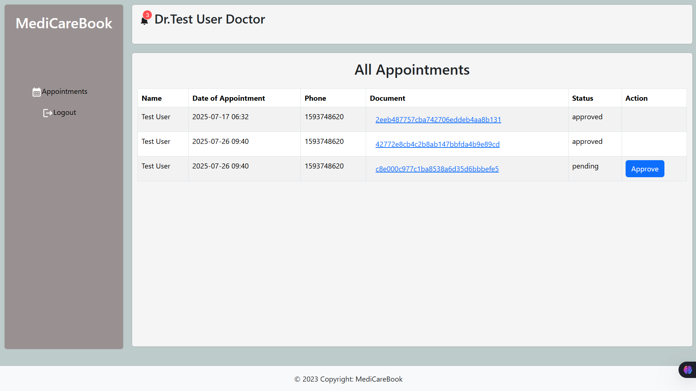
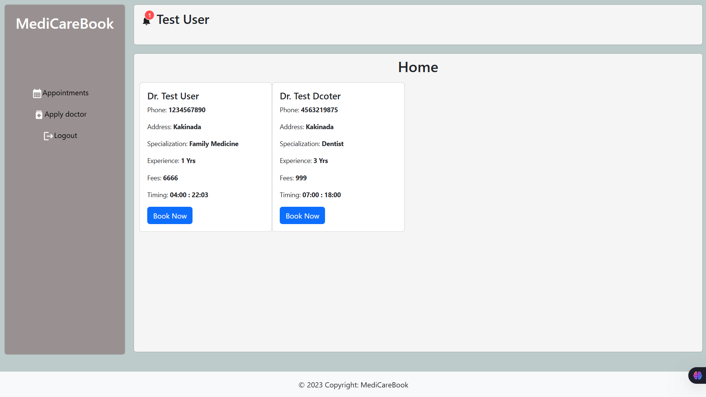

# DocSpot – Book Your Doctor Appointment Seamlessly 🏥

This project was developed as part of the **APSCHE Full Stack Internship Program**.
**DocSpot** is a full-stack MERN (MongoDB, Express, React, Node.js) application that allows users to book appointments with doctors, manage appointments, and provide role-based functionalities for Admins, Doctors, and Patients.

---

## 📄 Documentation

📎 [View the project Documentation.doc](https://docs.google.com/document/d/1_A-MJqEpj74TyB8pKbQHsh4gwIHr3ldk/edit?usp=sharing&ouid=112169026655648183402&rtpof=true&sd=true)

📎 [View the project Documentation.pdf](https://drive.google.com/file/d/1FqWruNiV6BDLlCKcOWvhjJSgn2qGVUy5/view?usp=sharing)

---

## 🎮 Demo Video

📺 [Click here to watch the video demo](https://drive.google.com/file/d/1NUw906C5zq8LbOtH_9izUQtXNUOeU9Db/view?usp=sharing)

---

## 🚀 Features

### 🔐 Authentication

* Role-based login: Admin, Doctor, Patient
* Secure JWT-based token authentication

### 🏥 Patient Module

* Register/Login as a patient
* View list of available doctors
* Book appointments with doctors
* View and manage personal appointments

### 💼 Doctor Module

* View appointments assigned to them
* Manage availability

### 🧱 Admin Module

* View all users
* View all doctors
* Manage roles

---

## 🧠 Technologies Used

* **Frontend**: React.js, Bootstrap
* **Backend**: Node.js, Express.js
* **Database**: MongoDB (Local and Atlas)
* **Authentication**: JWT (JSON Web Tokens)
* **Tools**: Axios, React Router, Nodemon

---

## 📸 UI Screenshots

### 1. Home Page  



### 2. Admin panel  


### 3. Doctor Appointment Page



### 4. Patient Dashboard



---

## 🛠️ How to Run Locally

### 🔹 1. Clone the Repository

```bash
git clone https://github.com/your-username/DocSpot.git
cd DocSpot
```

### 🔹 2. Setup Backend

```bash
cd backend
npm install
```

* Create a `.env` file inside `/backend` with:

```env
MONGO_DB=yourMangoDB_urlHere
PORT=8001
JWT_KEY=yourSecretKeyHere
```

* Start backend server:

```bash
npm start
```

* Backend runs at: [http://localhost:8001](http://localhost:8001)

### 🔹 3. Setup Frontend

```bash
cd ../frontend
npm install
```

* Start frontend server:

```bash
npm start
```

* Frontend runs at: [http://localhost:3000](http://localhost:3000)

### 🔹 4. Requirements

* Node.js (v16+)
* npm (comes with Node.js)
* MongoDB (Local or Atlas)

---

## ❓ Need Help?

* Open an issue on [GitHub](https://github.com/Mylapalli/DocSpot/issues)
* Or email: [yesebumylapalli08@gmail.com](mailto:your-email@example.com)

---

## 👨‍💼 Developed By

* Yesebu Mylapalli
* B.Tech CSE, Ideal Institute of technology
* GitHub: [your-username](https://github.com/MylapalliYesebu)
